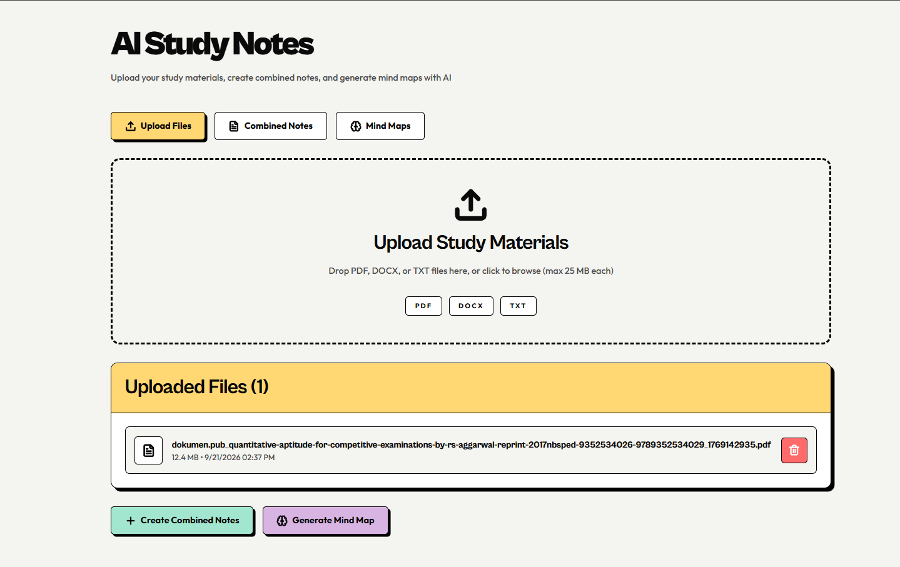
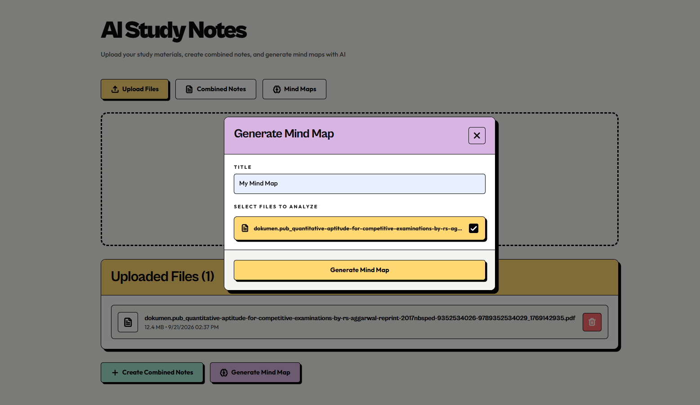
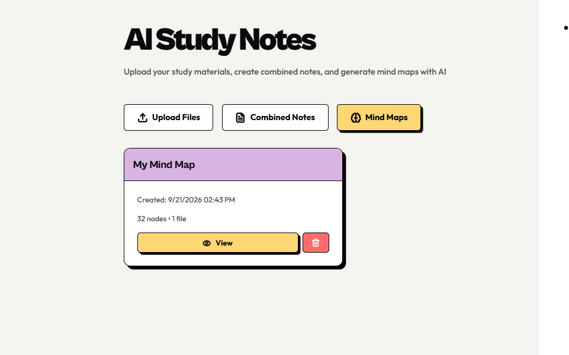

# AI Notes & Study

A full-stack app that turns your raw study material (PDFs, Word docs, text files) into AI-generated structured notes and interactive mind maps.

Upload your lecture slides, textbook chapters, or messy notes and the app extracts the text, sends it to Google Gemini, and gives you back clean, organized study notes and a visual mind map you can explore.

---

## Screenshots

### Dashboard


### Generate


### Mind Map


---

## What it does

- **Upload files** — drag and drop PDFs, `.docx`, or `.txt` files. Text is extracted automatically on upload.
- **Generate combined notes** — pick one or more uploaded files and generate detailed, structured study notes (headings, bullets, summaries, examples) from their combined content.
- **Generate mind maps** — turn the same material into a visual mind map (nodes + edges), rendered interactively with React Flow.
- **Browse history** — previously generated notes and mind maps are saved and listed for later viewing.

---

## Tech stack

**Backend**
- FastAPI (Python) — REST API under `/api`
- MongoDB (via Motor, async driver) — stores uploaded files, generated notes, and mind maps
- Google Gemini API (`google-genai`) — generates notes and mind map structure
- PyPDF2 / python-docx — text extraction from PDF and Word files

**Frontend**
- React 18 + React Router
- Tailwind CSS
- React Flow — interactive mind map rendering
- Axios — API calls
- Sonner — toast notifications

---

## Project structure

```
AI-STUDY-NOTES/
├── app/
│   ├── backend/
│   │   ├── server.py              # FastAPI app — all API routes
│   │   ├── requirements.txt       # Python dependencies
│   │   └── .env                   # Backend secrets (not committed)
│   └── frontend/
│       ├── src/
│       │   ├── App.js             # Root component + router
│       │   ├── api.js             # Shared axios client
│       │   ├── pages/
│       │   │   └── Dashboard.js   # Main app page
│       │   ├── components/
│       │   │   ├── FileUploadZone.js
│       │   │   ├── FileList.js
│       │   │   ├── ProcessNotesDialog.js
│       │   │   ├── CombinedNotesList.js
│       │   │   ├── ViewNoteDialog.js
│       │   │   ├── GenerateMindMapDialog.js
│       │   │   ├── MindMapsList.js
│       │   │   └── ViewMindMapDialog.js
│       │   └── utils/format.js
│       ├── package.json
│       └── craco.config.js
├── docs/screenshots/               # README images
└── README.md
```

---

## Prerequisites

- Python 3.10+
- Node.js 18+ and npm
- A MongoDB instance (local or Atlas connection string)
- A Google Gemini API key ([aistudio.google.com/app/apikey](https://aistudio.google.com/app/apikey))

---

## Setup

### 1. Backend

```bash
cd app/backend
python -m venv .venv && source .venv/bin/activate   # Windows: .venv\Scripts\activate
pip install -r requirements.txt
```

Create `app/backend/.env` with:

```bash
GEMINI_API_KEY=your_gemini_api_key
GEMINI_MODEL=gemini-2.5-flash
MONGO_URL=your_mongodb_connection_string
DB_NAME=your_database_name
CORS_ORIGINS=http://localhost:3000,http://127.0.0.1:3000
```

Run the API:

```bash
uvicorn server:app --reload --port 8000
```

The API is now running at `http://127.0.0.1:8000`, with all routes under `/api`.

### 2. Frontend

```bash
cd app/frontend
npm install
```

The frontend proxies `/api` to `http://127.0.0.1:8000` in development, so no `.env` is required locally. If you deploy the backend elsewhere, create `app/frontend/.env` with:

```bash
REACT_APP_BACKEND_URL=https://your-deployed-backend-url
```

Run the app:

```bash
npm start
```

The app opens at `http://localhost:3000`.

---

## API overview

All routes are prefixed with `/api`.

| Method | Route | Description |
|---|---|---|
| `GET` | `/` | Health check / hello message |
| `GET` | `/health` | Health check |
| `POST` | `/upload` | Upload a file (PDF, DOCX, or TXT); extracts and stores its text |
| `GET` | `/files` | List all uploaded files |
| `DELETE` | `/files/{file_id}` | Delete an uploaded file |
| `POST` | `/process-notes` | Generate structured study notes from selected file(s) |
| `GET` | `/combined-notes` | List previously generated notes |
| `DELETE` | `/combined-notes/{note_id}` | Delete a note |
| `POST` | `/generate-mindmap` | Generate a mind map (nodes/edges) from selected file(s) |
| `GET` | `/mindmaps` | List previously generated mind maps |
| `DELETE` | `/mindmaps/{mindmap_id}` | Delete a mind map |

---

## Notes

- Supported upload formats: PDF (`application/pdf`), Word (`.docx`), and plain text (`.txt`). Other file types are rejected.
- Both `/process-notes` and `/generate-mindmap` divide combined input text across selected files (12,000 / 8,000 characters respectively) before sending it to the Gemini API, so very large uploads may be partially summarized.
- No secrets are committed — the `.env` file is gitignored. Fill it in locally following the Setup section above.

---

## License

MIT
